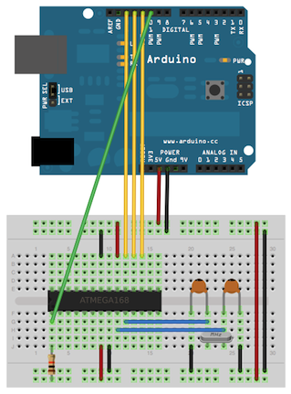

---
layout: post
title: Arduino as ICSP - Programmeur pour microcontrôleurs atmel
description: Comment transformer son arduino en un programmeur pour
  microcontroleurs Atmel. Cela permet notamment de charger le boot
  loader arduino sur de nouveaux ATMegas.
author: Jérémy Cochoy
date: 2012-05-25 +0100
categories: hardware software programming
lang: fr
...

## ICSP?

ICSP (In-Circuit Serial Programming) ou encore ISP est le nom donné à l’interface de programmation des microcontroleurs pouvant être reprogrammés _in situ_. C’est le cas des AVR de chez Atmel, dont figure la très célèbre famille des Atméga (Atmega328P pour la carte arduino uno), mais aussi les petits ATtiny, qui n’ont que peu à envier aux atméga, puisque pouvant surpasser la cadence des seconds (20Mhz pour l’attiny84 et l’attiny85).

Si vous disposez d'une carte arduino, vous ne programmez pas votre microcontroleur grâce à l'ICSP, mais via le bootloader arduino qui à chaque démarrage (appui sur reset si vous préférez, ou mise sous tension) attend quelques instants une éventuelle communication sur les pins 0 et 1 (RX et TX) avant de finalement lancer votre programme (aussi appelé sketch). Vous l'aurez compris, la programmation d'une arduino se fait en effectuant un reset et en transmettant les données sous la forme d'une [liaison série asynchrone][uart].

L'inconvénient de cette méthode est qu'un microcontroleur "brut de fonderie" ne permet pas une telle chose (c'est le cas quand vous achetez directement des PIC, PICAXE ou ATMegas au constructeur) et qu'il faut donc charger le bootloader arduino.

Une autre raison, plus pragmatique, est que le bootloader arduino mange tout de même plus d'une page mémoire, et que pour certaines applications -- une aventure qui ne m'est pour le moment pas arrivée -- il peut être utile de gagner quelques précieux octets.

La programmation atmel se fait via une interface SPI pour [Serial Peripheral Interface][serial-peripherical-interface] (c'est à ce moment que l'ordre des lettres d'un acronyme devient crucial pour ne pas se retrouver confus).

### Arduino as ISP

Par chance, des gens bienveillants se sont sacrifiés pour implémenter un programmateur ISP à travers la carte arduino. Concrètement, l'utilisation du sketch Arduino As ISP (disponible dans la rubrique 'exemples' de l'IDE arduino) permet de transformer la carte arduino en un programmateur ISP, dialoguant avec le PC d'une façon _standard_ -- comprenez que les utilitaires pour avr comme avrdude arrivent à communiquer avec l'arduino -- et pouvant programmer un microcontroleur atmel... si vous avez de la chance.

Retenez qu'un programmateur ISP d'atmels doit avoir le contrôle sur 4 pins du composant : Le pin reset, car le protocole de programmation demande de pouvoir faire des _choses bizarres_ avec ce dernier, et les 3 pins SPI (MISO, MOSI et SCLK. On n'utilise pas le SS). Le cablage de votre arduino avec un atmega est décrit :

- Dans le code de l'Arduino As ISP; les pins utilisés par le sketch sont indiqués.
  Y figure aussi au port 9 un "heartbeat" qui permet de savoir quand votre sketch
  a planté -- ce qui arrive plus souvent qu'on le souhaiterait.
- Sur le [site officiel arduino][arduino-to-breadboard], dont l'image suivante est tirée.

Voici donc le schéma d'un montage avec votre arduino comportant le sketch Arduino As ISP, pour programmer un atmega328p (si vous voulez programmer un autre atmel, il suffit de rechercher les ports MOSI, MISO, SCLK et reset, puis de câbler comme sur l'atmega328p).



Sachez que, pour ma part, j'ai dû modifier le sketch d'Arduino As ISP, en changeant le baud-rate de la liaison série (avec le PC) à 9600 (par défaut 19200), pour que tout se passe bien. (La première ligne de setup() :   Serial.begin(19200); )

### Horloge?

Si la résistance de pull-up sur le reset n'est pas obligatoire, pour un microcontroleur sorti de l'usine, il se peut que vous ayez besoin d'une horloge externe. L'horloge externe ou interne se configure via les fuses (fusibles), des registres spéciaux que l'on peut modifier... via ICSP -- donc, une fois que vous aurez réussi à faire fonctionner tout ce beau monde, ce qui ne nous aide pas.

Pour ma part, j’ai été obligé d’ajouter une horloge externe pour avoir une réponse du microcontroleur lorsqu’on lui demande d’épeler son nom (signature du composant). Un simple crystal 16MHz avec deux condensateurs 22pF -- non, ça ne marche pas avec 22nF, ce n’est pas faute d’avoir essayé... -- fera l’affaire. Il est fort probable qu’un crystal à 8MHz convienne aussi -- avec les mêmes condensateurs.

### Let's GO!

Votre sketch est sur votre arduino, votre circuit est opérationnel, vous avez vérifié chaque câble, chaque branchement, et relu le schéma 8 fois? Bien, alors revérifiez encore une fois dans le doute.

Installez la suite AVRtools (WinAVR pour windows, votre gestionnaire de paquets sous linux, et pour les autres, à vous de vous débrouiller :D ). Ne pas hésiter à consulter la [documentation de AVRtools][avr-tools].

Lancez avrdude, avec une commande de cette forme :
```shell
avrdude -p atmega328p -c avrisp -P com4 -b 9600
```
Où vous remplacez atmega328p par votre microcontroleur, et com4 par votre port. Pensez aussi à entrer le baud-rate (-b) figurant dans le code du sketch Arduino As ISP. Si tout va bien (vous devez obtenir une réponse de votre microcontroleur, et les noms attendu et reçu doivent correspondre), vous pouvez alors envoyer un sketch avec :
```shell
avrdude -p atmega328p -c avrisp -P com4 -b 9600 -U flash:w:sketch.hex
```
Pour plus de détails sur avrdude, référez-vous à la documentation, ou bien
au site de [LadyAda][avrdude].

Sur ce, amusez vous bien :)

__Nb :__ Pour calculer les fuses, j'utilise [FuseCalc][fuse-calc].

[serial-peripherical-interface]: http://en.wikipedia.org/wiki/Serial_Peripheral_Interface_Bus
[uart]: http://fr.wikipedia.org/wiki/UART
[arduino-to-breadboard]: http://arduino.cc/en/Tutorial/ArduinoToBreadboard
[avrdude]: http://www.ladyada.net/learn/avr/avrdude.html
[avr-tools]: http://www.nongnu.org/avr-libc/user-manual/using_tools.html
[fuse-calc]: http://www.engbedded.com/fusecalc
