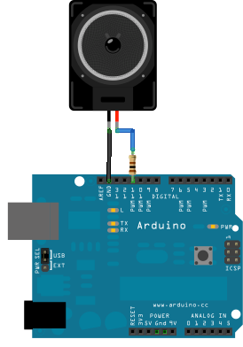

---
layout: post
title: Boite à musique Arduino
description: Une micro-bibliothèque pour jouer une mélodie polyphonique sur arduino en C.
  Contient le code, la documentation, et la melodie de tétris comme exemple.
author: Jérémy Cochoy
date: 2013-08-16 +0100
categories: arduino software music asm c embeded
lang: fr
redirect_from:
  - /blog/arduino
...

Dans la lignée du dépoussiérage de vieux codes, j'ai ressorti un jeu de quelques fonctions pour arduino que je n'avais pas eu le temps de publier. Il s'agit d'une certaine façon d'une bibliothèque similaire à la lib "Tone" fournie avec l'Arduino. Toutefois, contrairement à cette dernière, c'est bien un instrument polyphonique dont vous disposez. À dire vrai, il y a 4 canaux d'onde carré, et un canal de bruit. On peut de plus régler l'amplitude sonore de chacun des canaux entre 0 (minimum) et 255 (maximum). Il y a tout de même une contrainte ; la somme des amplitudes ne doit pas excéder 255. Ainsi, jouer de la musique est relativement simple. Il suffit de choisir la fréquence et l'amplitude de chaque canal, puis d'attendre un certain laps de temps (fonction delay fournis avec les libs de l'arduino) avant de recommencer. Le bruit est généré grâce à une table de valeurs aléatoires près-calculés, pour des raisons de performances. Vous pouvez réduire ou augmenter la taille de cette table à votre guise, un "script C++"(trop peu de lignes pour parler de programme) permettant de générer le header.

Tout ceci est plutôt abstrait, alors regardons cela de plus près.

## Montage de test :

Le montage de test est très similaire à celui du tutoriel tone. Seul change le port sur lequel vous devez connecter votre speacker.

[](data/music_box_arduino.png)

Donc, une résistance d'une centaine d'ohms (prenez ce que vous avez sous la main, plus la résistance sera élevée, moins le volume le sera) reliée à un speacker, ou bien à une prise JACK pour brancher vos enceintes favorites.

Si vous souhaitez changer le port de sortie, il vous faudra toucher au code (et au code asm aussi :/) car le code utilise un mécanisme de l'ATMEGA328P qui n'est disponible que sur les ports 11, 10, 9, 6, 5 et 3 de l'arduino (ceux marqués d'une petite vague). De plus, si vous souhaitez utiliser le port 3 conjointement à ce code, vous risquez d'avoir quelques soucis. (Ces ports sont regroupés en paires, et chaque port d'une paire ne peut émettre un signal qu'à la même fréquence. Vous ne pourrez pas non plus utiliser l'interruption du timer 2, utilisé par ces deux ports. Ici, le code utilise la fréquence maximum possible, donc cela ne devrait à priori pas poser de soucis pour les utilisations les plus simples du port 3, comme contrôler l'intensité lumineuse d'une led).

## Fonctionnement de la Lib

L'utilisation se fait via le header Synth_8bits.h qui définit plusieurs variables globales essentielles au fonctionnement.
Dans un premier temps, il faut initialiser la lib en appelant `synth_setup();`. Par la suite, vous disposez de 4 variables de période / fréquences :
``` c
extern int square1_period;
extern int square2_period;
extern int square3_period;
extern int square4_period;
```

En fait, c'est la période de l'onde qui est stockée, exprimée en 62500ième de seconde. Une macro, frequency_to_period(f), s'occupe de convertir une fréquence f (en Hz) en une période. Un exemple d'utilisation serait :
``` c
square1_period = frequency_to_period(440); //Le LA de référence est à 440Hz
```

De nombreuses macros et un tableau sont là pour vous permettre de choisir une note de façon plus agréable :
``` c
square1_period = frequency_to_period(NOTE_A4); //Pour encoder, directement dans votre code, une mélodie
square1_period = frequency_to_period(note_table[BNOTE_A4]); //Pour pouvoir facilement générer des mélodies à partir d'algorithmes.
```

Reste un détail important : le volume de sortie! Il se fait à l'aide des
``` c
extern unsigned char square1_amplitude;
extern unsigned char square2_amplitude;
extern unsigned char square3_amplitude;
extern unsigned char square4_amplitude;
```

Où vous pouvez choisir une amplitude sonore entre 0 (pas de son) et 255 (volume maximum). Attention ! La somme des volumes de tous les canaux doit être inférieure à 255 ! (Sinon et ben, ça sera moche et tout sauf musical ;) ).

Vous pouvez ainsi créer vos propres instruments en superposant différentes fréquences, et en modifiant le volume des canaux au cours du temps (par exemple, si vous voulez un son qui s'atténue, décrémentez petit à petit l'amplitude jusqu'à ce qu'elle atteigne 0). Le second exemple sonore exploite cette possibilité.

Pour les percussions, il y a le canal de bruit.
``` c
extern unsigned char noise_amplitude;
```
C'est un canal qui émet un son similaire à celui d'un vieux téléviseur sans antennes, un "Tshhhhh" très caractéristique. À nouveau, en faisant varier l'amplitude (on parle de modulation d'amplitude), vous pouvez créer le timbre de divers instruments de percussion. La fonction `play_seawave();` est un exemple.

Le bruit est près calculé grâce au programme C++ *generate_white_noise.cpp.src* (qui n'est autre qu'un fichier .cpp). Vous pouvez le bidouiller pour diminuer ou agrandir la table.

Code et exemple de test
=======================

Voici le code directement dans ce billet, et sous la forme d'un tar un peu plus loin. Les commentaires sont plutôt explicites :

``` c
// Synth_8bits.h :

#ifndef SYNTH_8BITS_H_
# define SYNTH_8_BITS_H_

//Some macros
#define frequency_to_period(f) (62500 / (f))

/*
#ifdef __cplusplus
extern "C" {
#endif
*/

/*************************************************************************/
/* Here come definitions and prototypes for the Synth_8bits library      */
/* All this stuff is given, without guaranty, and under the BSD licence. */
/*                                 ---                                   */
/* By Jeremy Cochoy                                                      */
/*************************************************************************/

//White noise table, in progmem
extern char white_noise[4096];

/////////////////////////
// Settings / Controls //
/////////////////////////

//Periods, stored after applying the right calculus with frequency_to_period(int)
extern int square1_period;
extern int square2_period;
extern int square3_period;
extern int square4_period;

// 0 = full speed, 255 = slowest (for a tv white noise sound
// use 20, which i the default value)
extern unsigned char noise_speed;

//Output amplitudes. Make sure that the sum of all your amplitudes of synth is < than 256!

extern unsigned char square1_amplitude;
extern unsigned char square2_amplitude;
extern unsigned char square3_amplitude;
extern unsigned char square4_amplitude;

extern unsigned char noise_amplitude;

/*************************************************
* Public Constants, from Tone Lybrary, by B Hagman
*  see : http://code.google.com/p/arduino-tone/source/browse/trunk/Tone.h
*************************************************/

#define NOTE_B0  31
#define NOTE_C1  33
#define NOTE_CS1 35
#define NOTE_D1  37
#define NOTE_DS1 39
#define NOTE_E1  41
#define NOTE_F1  44
#define NOTE_FS1 46
#define NOTE_G1  49
#define NOTE_GS1 52
#define NOTE_A1  55
#define NOTE_AS1 58
#define NOTE_B1  62
#define NOTE_C2  65
#define NOTE_CS2 69
#define NOTE_D2  73
#define NOTE_DS2 78
#define NOTE_E2  82
#define NOTE_F2  87
#define NOTE_FS2 93
#define NOTE_G2  98
#define NOTE_GS2 104
#define NOTE_A2  110
#define NOTE_AS2 117
#define NOTE_B2  123
#define NOTE_C3  131
#define NOTE_CS3 139
#define NOTE_D3  147
#define NOTE_DS3 156
#define NOTE_E3  165
#define NOTE_F3  175
#define NOTE_FS3 185
#define NOTE_G3  196
#define NOTE_GS3 208
#define NOTE_A3  220
#define NOTE_AS3 233
#define NOTE_B3  247
#define NOTE_C4  262
#define NOTE_CS4 277
#define NOTE_D4  294
#define NOTE_DS4 311
#define NOTE_E4  330
#define NOTE_F4  349
#define NOTE_FS4 370
#define NOTE_G4  392
#define NOTE_GS4 415
#define NOTE_A4  440
#define NOTE_AS4 466
#define NOTE_B4  494
#define NOTE_C5  523
#define NOTE_CS5 554
#define NOTE_D5  587
#define NOTE_DS5 622
#define NOTE_E5  659
#define NOTE_F5  698
#define NOTE_FS5 740
#define NOTE_G5  784
#define NOTE_GS5 831
#define NOTE_A5  880
#define NOTE_AS5 932
#define NOTE_B5  988
#define NOTE_C6  1047
#define NOTE_CS6 1109
#define NOTE_D6  1175
#define NOTE_DS6 1245
#define NOTE_E6  1319
#define NOTE_F6  1397
#define NOTE_FS6 1480
#define NOTE_G6  1568
#define NOTE_GS6 1661
#define NOTE_A6  1760
#define NOTE_AS6 1865
#define NOTE_B6  1976
#define NOTE_C7  2093
#define NOTE_CS7 2217
#define NOTE_D7  2349
#define NOTE_DS7 2489
#define NOTE_E7  2637
#define NOTE_F7  2794
#define NOTE_FS7 2960
#define NOTE_G7  3136
#define NOTE_GS7 3322
#define NOTE_A7  3520
#define NOTE_AS7 3729
#define NOTE_B7  3951
#define NOTE_C8  4186
#define NOTE_CS8 4435
#define NOTE_D8  4699
#define NOTE_DS8 4978

/**********
 * A table that contain all those frequencies (89)
 * stored in sram.
 **********/
extern int note_table[];

/**********
 * Give the 8bits index of the previous table, if you know the note
 **********/
#define BNOTE_B0	0
#define BNOTE_C1	1
#define BNOTE_CS1	2
#define BNOTE_D1	3
#define BNOTE_DS1	4
#define BNOTE_E1	5
#define BNOTE_F1	6
#define BNOTE_FS1	7
#define BNOTE_G1	8
#define BNOTE_GS1	9
#define BNOTE_A1	10
#define BNOTE_AS1	11
#define BNOTE_B1	12
#define BNOTE_C2	13
#define BNOTE_CS2	14
#define BNOTE_D2	15
#define BNOTE_DS2	16
#define BNOTE_E2	17
#define BNOTE_F2	18
#define BNOTE_FS2	19
#define BNOTE_G2	20
#define BNOTE_GS2	21
#define BNOTE_A2	22
#define BNOTE_AS2	23
#define BNOTE_B2	24
#define BNOTE_C3	25
#define BNOTE_CS3	26
#define BNOTE_D3	27
#define BNOTE_DS3	28
#define BNOTE_E3	29
#define BNOTE_F3	30
#define BNOTE_FS3	31
#define BNOTE_G3	32
#define BNOTE_GS3	33
#define BNOTE_A3	34
#define BNOTE_AS3	35
#define BNOTE_B3	36
#define BNOTE_C4	37
#define BNOTE_CS4	38
#define BNOTE_D4	39
#define BNOTE_DS4	40
#define BNOTE_E4	41
#define BNOTE_F4	42
#define BNOTE_FS4	43
#define BNOTE_G4	44
#define BNOTE_GS4	45
#define BNOTE_A4	46
#define BNOTE_AS4	47
#define BNOTE_B4	48
#define BNOTE_C5	49
#define BNOTE_CS5	50
#define BNOTE_D5	51
#define BNOTE_DS5	52
#define BNOTE_E5	53
#define BNOTE_F5	54
#define BNOTE_FS5	55
#define BNOTE_G5	56
#define BNOTE_GS5	57
#define BNOTE_A5	58
#define BNOTE_AS5	59
#define BNOTE_B5	60
#define BNOTE_C6	61
#define BNOTE_CS6	62
#define BNOTE_D6	63
#define BNOTE_DS6	64
#define BNOTE_E6	65
#define BNOTE_F6	66
#define BNOTE_FS6	67
#define BNOTE_G6	68
#define BNOTE_GS6	69
#define BNOTE_A6	70
#define BNOTE_AS6	71
#define BNOTE_B6	72
#define BNOTE_C7	73
#define BNOTE_CS7	74
#define BNOTE_D7	75
#define BNOTE_DS7	76
#define BNOTE_E7	77
#define BNOTE_F7	78
#define BNOTE_FS7	79
#define BNOTE_G7	80
#define BNOTE_GS7	81
#define BNOTE_A7	82
#define BNOTE_AS7	83
#define BNOTE_B7	84
#define BNOTE_C8	85
#define BNOTE_CS8	86
#define BNOTE_D8	87
#define BNOTE_DS8	88

//////////////
//Prototypes//
//////////////

//Initialisation (call it in void setup() )
void synth_setup();

//Play some chord 'like' an orgue
// (do not forget to delay a little time after...)
void play_org(int f);

//Play waves from the sea/beach
// (just call it in a while(true) )
void play_seawave();

/*
#ifdef __cplusplus
}
#endif
*/

#endif /* !SYNTH_8BITS_H_ */
</pre>

<br/>
Synth_8bits_lib.cpp :<pre lang="C" colla="-">#include <avr/io.h>
#include <avr/interrupt.h>

#include <Arduino.h>

#include "Synth_8bits.h"
#include "white_noise.h"

//Periods, stored after applying the right calculus with frequency_to_period(int)
int square1_period = 0;
int square2_period = 0;
int square3_period = 0;
int square4_period = 0;

// 0 = full speed, 255 = slowest (for a tv white noise sound, use 20
unsigned char noise_speed = 20;

//Output amplitudes. Make sure that the sum of all your amplitudes of synth is < than 256!

unsigned char square1_amplitude = 0;
unsigned char square2_amplitude = 0;
unsigned char square3_amplitude = 0;
unsigned char square4_amplitude = 0;

unsigned char noise_amplitude = 0;

///////////////////////
// PRIVATE VARIABLES //
///////////////////////
//Counters used to synthetise at the right frequency

int square1_id = 0;
int square2_id = 0;
int square3_id = 0;
int square4_id = 0;

int noise_id = 0;

unsigned char noise_delay = 0;

//Note table
int note_table[] = {31, 33, 35, 37, 39, 41, 44, 46, 49, 52, 55, 58, 62, 65, 69, 73, 78, 82, 87, 93, 98,
  104, 110, 117, 123, 131, 139, 147, 156, 165, 175, 185, 196, 208, 220, 233, 247, 262, 277, 294, 311, 330,
  349, 370, 392, 415, 440, 466, 494, 523, 554, 587, 622, 659, 698, 740, 784, 831, 880, 932, 988, 1047, 1109,
  1175, 1245, 1319, 1397, 1480, 1568, 1661, 1760, 1865, 1976, 2093, 2217, 2349, 2489, 2637, 2794, 2960, 3136,
  3322, 3520, 3729, 3951, 4186, 4435, 4699, 4978};

void synth_setup()
{
  //Fast PWM
  //COM2A 1:0 = 2 -> not inverted
  //WGM0 2:1:0 = 3 -> FAST PWM
  TCCR2A = _BV(COM2A1) | _BV(WGM01) | _BV(WGM00);

  //Timer setting
  //Setup the mask
  TIMSK2 = _BV(TOIE2);
  //Set N=1 : no divisor
  TCCR2B = 0 << CS22 | 0 << CS21 | 1 << CS20;

  //OC2A[The pwm pin] is pin B3(~11)
  DDRB = _BV(DDB3);
}

/*
// OLD C-CODE
// TOO SLOW TO BE USED AT THIS FREQUENCY :(

void inline compute_square_wave(int &out, int &square_id, unsigned char &square_amplitude, int &square_period)
{
  square_id = square_id & (4096 - 1);
  if (square_id > 2048)
    out += square_amplitude;
  //Center the square wave
  out -= square_amplitude >> 1;
  square_id += square_period;
};

//The synthetiser
ISR(TIMER2_OVF_vect)
{
   int out = 128;

  //Square waves
  compute_square_wave(out, square1_id, square1_amplitude, square1_period);
  compute_square_wave(out, square2_id, square2_amplitude, square2_period);
  //compute_square_wave(out, square3_id, square3_amplitude, square3_period);

  OCR2A = out;
}
*/

// ------------ SQUARE WAVE GENERATOR -----------------------+
#define square_wave0(amplitude, period, id)                  \
      asm volatile (                                         \
    	"lds r24, " period "\n" /* load period low */        \
	"lds r25, (" period ")+1\n" /* load period high */       \
        "lds r30, " id "\n" /* load id low */                \
        "lds r31, (" id ")+1\n" /* load id high */           \
        "lds r28, " amplitude "\n" /* load amplitude */      \
                                                             \
        /* square1_id &= (8192-1) ; 4096-1 = 0xFFF */        \
        "andi r31, hi8(8191)\n"                              \
                                                             \
        /* if (r >= 4096) goto .Lb_<something> */            \
        "cpi r31, hi8(4096)\n"                               \
        "brge .Lb_%=\n"                                      \
                                                             \
        /* Add the amplitude */                              \
        "add r23, r28\n"                                     \
                                                             \
        ".Lb_%=:\n"                                          \
                                                             \
        /* out -= square_amplitude/2 */                      \
        "lsr r28\n" /* logical shift right = >> 1 */         \
        "sub r23, r28\n"                                     \
                                                             \
        /* square_id += square_period */                     \
        "add r30,r24\n"                                      \
        "adc r31,r25\n"                                      \
        "sts " id ",r30\n"                                   \
        "sts (" id ")+1,r31\n"                               \
        ::)

/* NEW ONE  */
// ------------ SQUARE WAVE GENERATOR -----------------------+
#define square_wave(amplitude, period, id)                   \
      asm volatile (                                         \
    	"lds r24, " period "\n" /* load period low */        \
	"lds r25, (" period ")+1\n" /* load period high */       \
        "lds r30, " id "\n" /* load id low */                \
        "lds r31, (" id ")+1\n" /* load id high */           \
        "lds r28, " amplitude "\n" /* load amplitude */      \
                                                             \
        /* if (id < period) goto .do_not_reset_<something> */\
        "cp r30, r24\n"                                      \
        "cpc r31, r25\n"                                     \
        "brlt .do_not_reset_%=\n"                            \
        /* Reset id and go to the end of the function */     \
        "ldi r30,0\n" /* id = 0 */                           \
        "ldi r31,0\n"                                        \
        "sts " id ",r30\n"                                   \
        "sts (" id ")+1,r31\n"                               \
        "rjmp .end_%=\n"                                     \
        ".do_not_reset_%=:\n"                                \
                                                             \
        /* if (id >= period/2) goto .Lb_<something> */       \
        "lsr r25\n"                                          \
        "ror r24\n"                                          \
        "cp r30, r24\n"                                      \
        "cpc r31, r25\n"                                     \
        "brge .Lb_%=\n"                                      \
                                                             \
        /* Add the amplitude */                              \
        "add r23, r28\n"                                     \
                                                             \
        ".Lb_%=:\n"                                          \
                                                             \
        /* out -= square_amplitude/2 */                      \
        "lsr r28\n" /* logical shift right = >> 1 */         \
        "sub r23, r28\n"                                     \
                                                             \
        /* square_id += 1 */                                 /*
        // You can also use :
        "ldi r24, 1\n"                                       \
        "ldi r25, 0\n"                                       \
        "add r30,r24\n"                                      \
        "adc r31,r25\n"                                      \*/\
        "adiw r30, 1\n"                                      \
        "sts " id ",r30\n"                                   \
        "sts (" id ")+1,r31\n"                               \
                                                             \
        ".end_%=:\n"                                         \
        ::)

ISR(TIMER2_OVF_vect, ISR_NAKED)
{
  asm volatile (
    "push r30\n" //square_id low
    "push r31\n" //square_id high
    "push r28\n" //square_amplitude
    "push r23\n" //out
    "push r24\n" //square_period low
    "push r25\n" //square_period high
    "in r23, __SREG__\n"
    "push r23\n"

    "ldi r23, lo8(128)\n" //out=128
    );

  //---------------
  //-  SQUARE  1  -
  //---------------
  square_wave("square1_amplitude", "square1_period", "square1_id");
  //---------------

  //---------------
  //-  SQUARE  2  -
  //---------------
  square_wave("square2_amplitude", "square2_period", "square2_id");
  //---------------

  //---------------
  //-  SQUARE  3  -
  //---------------
  square_wave("square3_amplitude", "square3_period", "square3_id");
  //---------------

  //---------------
  //-  SQUARE  4  -
  //---------------
  square_wave("square4_amplitude", "square4_period", "square4_id");
  //---------------

  asm volatile (
    //if (noise_amplitude) : when there is no noise (in fact often ;) )
    // we skip all these code an prevent a lot's of cycles.
    "lds r30, noise_amplitude\n"
    "cpi r30, 0\n"

    "breq .no_noise\n"

    //Load noise id
    "lds r24, noise_id\n"
    "lds r25, (noise_id)+1\n"

    //Load white_noise addr
    "ldi r30, lo8(white_noise)\n"
    "ldi r31, hi8(white_noise)\n"

    //Sum noise_id and white_noise
    "add r30, r24\n"
    "adc r31, r25\n"

    //Load noise value into r28
    "lpm r28, Z\n"

    //We will use mult!
    "push r0\n"
    "push r1\n"

    //Load noise amplitude
    "lds r30, noise_amplitude\n"

    //r1:r0 = white_noise[noise_id] * noise_amplitude
    "mul r28, r30\n"

    //Add white_noise[noise_id] to out
    // (We want to divide r1:r0 by 255, but it's easyer to divide by 256, i.e.
    // only take the hight part r1 of the result :)
    "add r23, r1\n"

    "pop r1\n"
    "pop r0\n"

    //Load the delay value
    "lds r30, noise_delay\n"
    "lds r31, noise_speed\n"

    //If noise_delay <= noise_speed
    "cp r30, r31\n"
    "brge .inc_noise\n"
    //Increment noise_delay
    "inc r30\n"
    "rjmp .endif_delay_lt_speed\n"

    //else
    ".inc_noise:\n"
    //noise_delay = 0
    "ldi r30, lo8(0)\n"

    //Increment noise_id of 1
    "ldi r28, 1\n"
    "add r24, r28\n"
    "ldi r28, 0\n"
    "adc r25, r28\n"
    "andi r25, hi8(4095)\n"
    //Store the new noise_id value
    "sts noise_id, r24\n"
    "sts (noise_id)+1, r25\n"

    ".endif_delay_lt_speed:\n"
    //Store the new noise_delay value
    "sts noise_delay, r30\n"

    //endif (noise_activated)
    ".no_noise:\n");

  asm volatile (
    //Update OCR2A with the out(r23) value calculated
    "ldi r30,lo8(179)\n"
    "ldi r31,hi8(179)\n"
    "st Z, r23\n"

    //pop saved registers
    "pop r23\n"
    "out __SREG__, r23\n"
    "pop r25\n"
    "pop r24\n"
    "pop r23\n"
    "pop r28\n"
    "pop r31\n"
    "pop r30\n");
  reti();
}


///////////////////////////////////////////////
// Funny functions, used to make some noises //
///////////////////////////////////////////////


void play_org(int f)
{
    square1_amplitude = 100;
    square1_period = frequency_to_period(f);

    square2_amplitude = 60;
    square2_period = frequency_to_period(f*2);

    square3_amplitude = 40;
    square3_period = frequency_to_period(f*4);

    square4_amplitude = 20;
    square4_period = frequency_to_period(f*8);
}

void play_seawave()
{
  for (; noise_amplitude < 120;)
  {
   noise_amplitude+=2;
   delay(40);
  }
  for (; noise_amplitude > 10;)
  {
   noise_amplitude-=4;
   delay(40);
  }
  delay(700);
}
```


``` {.c}
// white_noise.h :

#ifndef WHITE_NOISE_H_
 #define WHITE_NOISE_H_

#include <avr/pgmspace.h>

char white_noise[4096] PROGMEM = {
70, 100, 49, 41, 100, 134, 237, 156, 215, 31, 194, 7, 37, 72, 32, 162,
196, 168, 90, 235, 11, 32, 65, 73, 79, 139, 241, 248, 205, 48, 241, 19,
148, 34, 60, 248, 168, 41, 149, 128, 73, 87, 135, 110, 159, 167, 17, 99,
80, 107, 78, 91, 140, 143, 164, 219, 27, 149, 211, 232, 197, 197, 251, 90,
231, 55, 82, 144, 96, 231, 16, 169, 62, 151, 24, 221, 62, 41, 65, 142,
148, 143, 233, 32, 31, 141, 251, 58, 34, 207, 34, 232, 148, 29, 66, 123,
84, 148, 11, 180, 124, 27, 94, 186, 178, 118, 152, 241, 159, 217, 127, 51,
104, 105, 84, 135, 246, 79, 193, 25, 30, 227, 1, 178, 0, 67, 46, 84,
215, 57, 9, 83, 85, 103, 14, 7, 221, 166, 248, 124, 127, 120, 175, 231,
225, 3, 111, 215, 83, 48, 240, 113, 20, 241, 36, 20, 52, 82, 105, 12,
139, 114, 95, 224, 217, 109, 232, 182, 19, 224, 50, 146, 88, 225, 122, 57,
229, 233, 17, 56, 25, 1, 169, 45, 243, 205, 66, 39, 31, 171, 51, 171,
29, 147, 139, 246, 0, 115, 172, 20, 84, 222, 166, 172, 191, 32, 230, 164,
9, 247, 220, 35, 248, 134, 80, 235, 83, 146, 19, 115, 61, 70, 30, 90,
217, 169, 80, 218, 29, 252, 238, 113, 218, 148, 29, 154, 181, 3, 62, 190,
250, 27, 225, 243, 161, 50, 222, 244, 196, 241, 103, 2, 56, 133, 92, 17,
47, 173, 235, 76, 169, 217, 189, 132, 110, 218, 30, 35, 222, 92, 225, 216,
119, 195, 203, 24, 245, 170, 13, 185, 155, 116, 187, 211, 250, 24, 229, 41,
197, 208, 117, 110, 170, 50, 242, 24, 12, 16, 59, 234, 109, 28, 195, 228,
223, 142, 253, 212, 56, 10, 142, 212, 126, 73, 167, 120, 97, 140, 161, 38,
93, 22, 149, 7, 72, 135, 31, 85, 152, 90, 63, 5, 118, 2, 233, 86,
145, 230, 42, 201, 240, 184, 157, 111, 2, 69, 231, 99, 209, 137, 138, 46,
159, 31, 53, 232, 166, 84, 61, 62, 174, 124, 67, 37, 127, 45, 123, 16,
19, 165, 217, 4, 94, 119, 115, 96, 188, 90, 195, 141, 227, 77, 188, 131,
108, 241, 107, 19, 70, 168, 81, 244, 36, 149, 25, 163, 194, 148, 179, 213,
58, 141, 217, 152, 4, 76, 248, 192, 167, 187, 77, 138, 9, 9, 13, 117,
251, 120, 136, 65, 32, 218, 53, 69, 111, 79, 232, 49, 227, 156, 6, 29,
41, 224, 181, 45, 44, 173, 237, 211, 105, 58, 94, 114, 68, 107, 231, 63,
228, 112, 128, 4, 74, 181, 73, 185, 4, 50, 234, 232, 206, 240, 5, 247,
208, 187, 36, 253, 104, 17, 208, 209, 75, 46, 67, 143, 154, 43, 206, 126,
155, 78, 130, 229, 4, 204, 158, 8, 254, 136, 240, 204, 120, 246, 195, 73,
177, 231, 70, 25, 248, 22, 235, 67, 69, 46, 211, 223, 89, 161, 93, 244,
240, 223, 217, 244, 171, 119, 252, 169, 255, 237, 117, 120, 227, 56, 193, 148,
31, 7, 173, 23, 29, 152, 91, 98, 199, 46, 65, 32, 207, 158, 21, 191,
126, 238, 179, 41, 102, 176, 211, 101, 157, 72, 221, 128, 129, 158, 20, 160,
165, 193, 184, 195, 90, 19, 37, 33, 65, 103, 65, 16, 5, 86, 208, 131,
69, 131, 173, 171, 51, 128, 16, 208, 200, 238, 80, 73, 140, 100, 234, 50,
38, 162, 245, 128, 181, 26, 161, 246, 129, 226, 6, 135, 57, 214, 10, 126,
90, 183, 41, 141, 55, 57, 94, 0, 39, 174, 73, 180, 19, 51, 230, 57,
213, 219, 185, 138, 245, 90, 128, 119, 60, 135, 254, 117, 93, 8, 243, 183,
192, 28, 69, 247, 86, 163, 247, 125, 81, 65, 49, 100, 116, 23, 157, 74,
242, 86, 212, 232, 176, 85, 95, 237, 220, 93, 98, 57, 101, 86, 241, 37,
114, 54, 29, 200, 217, 20, 70, 42, 85, 119, 143, 202, 143, 44, 20, 129,
131, 232, 105, 51, 61, 200, 32, 25, 37, 131, 83, 139, 217, 68, 176, 75,
122, 205, 20, 83, 226, 90, 125, 55, 209, 12, 1, 96, 57, 21, 226, 188,
254, 75, 239, 59, 20, 16, 85, 57, 147, 168, 196, 108, 236, 117, 183, 102,
66, 203, 185, 36, 37, 54, 92, 247, 67, 93, 87, 124, 115, 57, 56, 113,
133, 39, 172, 153, 55, 1, 210, 202, 169, 151, 54, 149, 12, 238, 251, 78,
185, 180, 115, 223, 235, 207, 214, 46, 44, 45, 170, 159, 103, 226, 16, 236,
9, 189, 133, 65, 190, 87, 11, 104, 238, 66, 253, 250, 48, 249, 73, 233,
173, 188, 200, 152, 139, 158, 198, 183, 204, 112, 87, 51, 82, 103, 31, 92,
36, 164, 157, 227, 251, 168, 75, 234, 234, 72, 228, 26, 65, 45, 4, 239,
233, 204, 135, 116, 107, 78, 44, 55, 190, 131, 106, 17, 234, 137, 109, 15,
45, 10, 242, 40, 178, 61, 18, 157, 133, 247, 183, 199, 36, 187, 182, 14,
136, 61, 130, 243, 139, 174, 42, 74, 49, 148, 91, 28, 29, 200, 43, 74,
210, 29, 114, 132, 90, 133, 33, 223, 124, 217, 166, 160, 148, 92, 174, 28,
154, 49, 15, 37, 223, 57, 111, 17, 205, 202, 45, 234, 146, 88, 52, 100,
117, 167, 233, 207, 44, 10, 174, 168, 227, 85, 72, 120, 177, 247, 148, 75,
40, 164, 113, 7, 221, 224, 24, 171, 171, 69, 149, 61, 157, 202, 162, 18,
113, 139, 225, 157, 149, 144, 69, 121, 229, 141, 241, 150, 132, 133, 226, 172,
41, 83, 180, 7, 51, 204, 178, 222, 18, 71, 28, 175, 17, 190, 194, 130,
73, 163, 31, 222, 51, 100, 87, 24, 242, 72, 175, 118, 206, 145, 35, 247,
228, 215, 254, 23, 163, 176, 246, 181, 248, 18, 101, 9, 208, 39, 140, 25,
202, 171, 247, 254, 16, 79, 22, 2, 151, 197, 120, 101, 86, 155, 93, 58,
114, 91, 82, 22, 12, 72, 203, 4, 90, 48, 13, 42, 87, 153, 67, 34,
69, 58, 32, 85, 137, 54, 87, 33, 252, 207, 134, 82, 107, 227, 141, 221,
63, 223, 243, 75, 39, 191, 79, 129, 239, 92, 171, 71, 246, 238, 105, 59,
40, 137, 144, 178, 191, 231, 211, 187, 182, 89, 14, 33, 61, 155, 255, 124,
122, 242, 199, 161, 177, 22, 34, 161, 114, 205, 232, 104, 187, 81, 163, 227,
218, 51, 149, 153, 26, 104, 85, 209, 194, 99, 242, 255, 254, 241, 123, 120,
228, 66, 25, 149, 88, 59, 54, 202, 8, 30, 51, 195, 111, 214, 166, 73,
10, 60, 227, 36, 164, 56, 245, 102, 155, 232, 101, 153, 217, 224, 17, 189,
34, 42, 83, 122, 101, 137, 69, 109, 168, 120, 48, 23, 78, 214, 97, 88,
18, 68, 125, 183, 124, 114, 29, 23, 90, 131, 176, 52, 99, 193, 241, 134,
235, 68, 0, 80, 206, 69, 189, 118, 189, 237, 141, 12, 195, 238, 100, 214,
50, 225, 141, 174, 84, 170, 197, 174, 45, 117, 226, 145, 54, 212, 23, 33,
24, 23, 113, 230, 93, 46, 92, 26, 27, 234, 38, 223, 216, 139, 181, 11,
108, 66, 185, 192, 236, 127, 111, 26, 244, 81, 171, 43, 37, 194, 76, 62,
217, 190, 36, 54, 236, 129, 81, 8, 107, 119, 231, 67, 2, 156, 78, 111,
222, 8, 47, 202, 135, 158, 228, 123, 240, 143, 166, 21, 81, 243, 83, 43,
177, 120, 97, 157, 249, 178, 165, 100, 42, 140, 167, 44, 40, 246, 155, 6,
254, 203, 209, 133, 105, 181, 0, 89, 69, 167, 111, 150, 154, 194, 193, 75,
58, 35, 232, 51, 213, 142, 151, 255, 26, 63, 44, 67, 53, 199, 73, 51,
146, 26, 184, 252, 208, 184, 85, 21, 95, 196, 171, 249, 135, 109, 68, 193,
144, 45, 245, 101, 187, 140, 101, 213, 203, 145, 24, 0, 88, 98, 51, 235,
124, 235, 231, 76, 164, 60, 97, 3, 1, 13, 253, 136, 122, 65, 73, 10,
110, 62, 111, 41, 203, 212, 255, 150, 101, 23, 151, 190, 121, 202, 169, 246,
182, 144, 66, 90, 204, 164, 93, 205, 177, 90, 85, 43, 156, 159, 53, 10,
221, 164, 52, 168, 121, 51, 63, 222, 74, 214, 156, 196, 160, 69, 186, 86,
213, 252, 176, 162, 160, 14, 111, 81, 104, 197, 124, 4, 100, 177, 15, 65,
86, 67, 234, 207, 118, 41, 173, 192, 255, 74, 132, 159, 143, 62, 246, 101,
59, 166, 7, 219, 180, 118, 45, 29, 59, 169, 33, 159, 91, 48, 225, 177,
115, 203, 128, 233, 244, 45, 170, 243, 119, 46, 146, 7, 109, 136, 108, 168,
47, 115, 131, 227, 233, 176, 0, 37, 90, 34, 196, 181, 82, 165, 102, 198,
112, 230, 175, 100, 19, 89, 87, 139, 136, 234, 146, 245, 114, 254, 157, 161,
113, 32, 133, 90, 209, 133, 127, 43, 167, 68, 224, 250, 233, 70, 192, 90,
44, 111, 190, 63, 201, 22, 202, 81, 0, 92, 70, 114, 90, 227, 20, 203,
3, 153, 38, 212, 30, 165, 255, 198, 233, 223, 192, 211, 37, 128, 45, 81,
239, 235, 145, 184, 1, 91, 9, 1, 184, 79, 116, 18, 50, 136, 222, 54,
33, 4, 10, 63, 169, 10, 5, 147, 233, 197, 102, 15, 69, 147, 96, 53,
126, 241, 237, 128, 77, 247, 129, 5, 70, 245, 23, 121, 125, 245, 175, 158,
249, 185, 222, 163, 195, 227, 54, 173, 169, 156, 188, 238, 47, 28, 35, 173,
14, 17, 45, 91, 8, 175, 96, 78, 164, 119, 199, 34, 109, 118, 192, 102,
48, 158, 9, 243, 130, 63, 160, 43, 219, 92, 25, 10, 121, 61, 184, 135,
78, 229, 226, 86, 148, 66, 164, 57, 185, 108, 91, 38, 226, 27, 141, 18,
186, 150, 6, 60, 214, 166, 103, 177, 3, 128, 188, 124, 189, 116, 3, 11,
89, 229, 97, 238, 39, 6, 39, 224, 114, 130, 7, 84, 157, 148, 103, 87,
42, 109, 147, 0, 19, 250, 178, 22, 123, 110, 146, 56, 226, 149, 68, 59,
122, 165, 41, 161, 171, 80, 130, 29, 210, 137, 114, 112, 29, 217, 199, 71,
70, 91, 72, 89, 85, 250, 112, 208, 104, 2, 9, 74, 152, 77, 133, 18,
242, 175, 180, 158, 255, 54, 187, 210, 191, 45, 66, 220, 6, 9, 35, 76,
100, 107, 166, 186, 101, 22, 138, 205, 24, 147, 23, 176, 224, 157, 195, 211,
76, 119, 113, 75, 173, 44, 29, 108, 90, 95, 72, 96, 105, 107, 173, 205,
215, 83, 135, 60, 105, 18, 10, 129, 165, 33, 50, 134, 190, 245, 89, 10,
108, 202, 86, 25, 246, 115, 133, 80, 211, 205, 177, 60, 56, 94, 9, 15,
177, 145, 76, 26, 163, 86, 155, 72, 119, 205, 206, 54, 194, 39, 64, 46,
241, 150, 71, 232, 10, 204, 56, 221, 153, 233, 25, 210, 71, 34, 225, 248,
179, 45, 18, 86, 131, 174, 159, 251, 123, 109, 49, 62, 149, 113, 108, 134,
8, 180, 110, 18, 128, 167, 239, 26, 144, 8, 236, 216, 42, 205, 208, 222,
251, 227, 52, 126, 145, 211, 121, 12, 65, 170, 74, 214, 28, 183, 92, 36,
107, 203, 54, 235, 114, 37, 5, 2, 45, 241, 218, 87, 191, 171, 53, 186,
142, 106, 56, 31, 61, 178, 43, 126, 92, 118, 84, 120, 45, 177, 156, 152,
124, 210, 131, 238, 247, 137, 240, 36, 122, 203, 124, 57, 118, 177, 243, 4,
27, 44, 35, 89, 222, 78, 215, 58, 196, 44, 179, 241, 221, 79, 137, 89,
34, 13, 71, 25, 150, 55, 62, 16, 2, 186, 74, 120, 107, 61, 124, 135,
105, 159, 224, 71, 238, 183, 130, 178, 227, 53, 164, 192, 132, 45, 25, 166,
58, 96, 192, 208, 152, 254, 225, 154, 184, 43, 19, 35, 104, 143, 170, 210,
47, 138, 25, 29, 66, 155, 207, 37, 208, 115, 230, 85, 161, 255, 251, 219,
96, 187, 172, 248, 185, 141, 146, 113, 184, 165, 149, 32, 53, 63, 242, 100,
202, 12, 129, 12, 167, 80, 49, 120, 196, 23, 205, 101, 23, 200, 64, 119,
132, 236, 111, 61, 121, 1, 175, 49, 167, 68, 82, 220, 131, 68, 64, 77,
80, 193, 89, 248, 17, 139, 112, 213, 162, 61, 58, 185, 5, 123, 48, 137,
103, 159, 199, 225, 161, 118, 18, 72, 186, 100, 36, 61, 169, 100, 139, 249,
37, 228, 241, 54, 111, 97, 12, 18, 158, 70, 203, 164, 193, 252, 45, 41,
155, 244, 10, 60, 106, 28, 132, 36, 129, 168, 98, 42, 12, 237, 35, 49,
209, 21, 104, 65, 118, 116, 83, 21, 186, 30, 185, 124, 26, 230, 165, 182,
219, 175, 242, 69, 203, 119, 106, 76, 31, 204, 118, 44, 185, 154, 93, 138,
175, 197, 203, 37, 57, 30, 58, 244, 61, 243, 112, 87, 218, 21, 13, 181,
196, 0, 250, 143, 119, 100, 220, 150, 48, 82, 194, 233, 236, 32, 116, 155,
229, 63, 193, 31, 94, 251, 19, 155, 239, 131, 242, 201, 152, 0, 126, 92,
0, 120, 235, 119, 221, 199, 13, 13, 26, 208, 247, 6, 240, 107, 162, 213,
170, 99, 244, 8, 94, 7, 163, 77, 138, 150, 22, 34, 150, 148, 126, 150,
13, 106, 13, 234, 49, 26, 247, 75, 234, 238, 82, 218, 89, 244, 176, 4,
87, 164, 12, 181, 172, 176, 3, 54, 70, 25, 89, 220, 174, 215, 114, 187,
65, 127, 165, 115, 153, 156, 190, 132, 139, 16, 94, 228, 4, 14, 232, 91,
179, 245, 17, 95, 165, 20, 149, 235, 45, 238, 199, 219, 198, 57, 150, 7,
184, 59, 122, 81, 216, 57, 213, 99, 73, 52, 71, 78, 66, 48, 169, 245,
37, 186, 84, 202, 206, 234, 181, 252, 216, 124, 215, 158, 181, 110, 166, 109,
169, 32, 190, 129, 89, 148, 228, 163, 200, 44, 241, 10, 92, 154, 0, 129,
85, 84, 75, 35, 62, 0, 31, 23, 124, 247, 181, 49, 101, 91, 158, 14,
124, 92, 144, 213, 240, 116, 120, 184, 160, 105, 195, 252, 4, 195, 125, 89,
23, 200, 124, 86, 200, 156, 109, 68, 147, 34, 117, 248, 126, 19, 6, 250,
112, 150, 207, 96, 11, 72, 25, 171, 177, 220, 168, 181, 159, 37, 14, 182,
238, 139, 12, 182, 39, 121, 251, 186, 156, 112, 178, 26, 132, 184, 20, 244,
79, 227, 84, 90, 43, 109, 5, 221, 73, 173, 146, 232, 211, 161, 159, 193,
44, 171, 119, 83, 37, 114, 13, 193, 227, 191, 219, 103, 119, 239, 91, 198,
210, 175, 32, 254, 29, 38, 219, 102, 211, 109, 79, 166, 14, 238, 103, 58,
153, 223, 141, 190, 81, 154, 127, 52, 89, 90, 155, 209, 73, 246, 151, 28,
166, 184, 26, 195, 222, 245, 41, 177, 98, 120, 88, 113, 102, 191, 171, 0,
158, 57, 190, 240, 211, 62, 36, 45, 152, 192, 254, 226, 182, 149, 254, 92,
77, 24, 31, 43, 13, 73, 221, 111, 193, 53, 224, 40, 244, 140, 40, 147,
197, 230, 131, 152, 36, 167, 197, 189, 103, 195, 159, 30, 89, 157, 122, 166,
181, 154, 210, 194, 227, 175, 49, 164, 228, 18, 204, 216, 158, 244, 107, 99,
219, 238, 251, 255, 150, 193, 188, 253, 132, 91, 27, 221, 248, 150, 132, 173,
48, 86, 111, 19, 5, 161, 183, 233, 179, 132, 193, 81, 120, 45, 180, 83,
27, 175, 83, 177, 112, 15, 175, 245, 107, 202, 210, 99, 96, 86, 17, 144,
172, 128, 163, 177, 33, 91, 154, 212, 223, 92, 37, 87, 137, 217, 171, 164,
137, 254, 86, 249, 13, 5, 238, 120, 207, 193, 220, 48, 23, 237, 192, 196,
109, 100, 117, 143, 191, 16, 99, 158, 108, 137, 245, 245, 98, 160, 153, 235,
158, 239, 229, 172, 244, 211, 36, 196, 148, 0, 244, 172, 237, 180, 112, 91,
24, 229, 234, 215, 245, 77, 117, 97, 214, 107, 86, 57, 11, 240, 36, 170,
223, 9, 86, 212, 221, 122, 152, 113, 123, 140, 29, 104, 64, 141, 195, 89,
115, 173, 48, 104, 251, 166, 202, 209, 17, 32, 10, 28, 16, 47, 198, 240,
56, 28, 196, 21, 151, 92, 135, 18, 232, 164, 122, 40, 50, 62, 129, 165,
235, 178, 13, 230, 88, 215, 184, 105, 248, 194, 133, 8, 241, 76, 248, 42,
104, 188, 63, 255, 24, 198, 17, 0, 107, 140, 41, 157, 202, 170, 66, 181,
92, 79, 156, 180, 39, 84, 29, 31, 22, 163, 39, 8, 239, 32, 50, 87,
220, 113, 87, 245, 56, 104, 245, 163, 244, 30, 64, 190, 201, 130, 116, 37,
209, 16, 218, 248, 100, 247, 23, 122, 154, 63, 130, 137, 95, 180, 225, 59,
38, 56, 48, 94, 160, 38, 1, 149, 68, 65, 83, 13, 195, 199, 51, 148,
215, 13, 141, 59, 4, 164, 182, 159, 227, 56, 40, 66, 237, 9, 126, 19,
65, 174, 113, 226, 212, 114, 119, 25, 179, 202, 38, 118, 146, 89, 10, 105,
102, 151, 165, 107, 60, 91, 10, 31, 147, 50, 98, 128, 60, 224, 147, 125,
142, 4, 95, 99, 118, 214, 124, 41, 161, 162, 159, 51, 252, 170, 156, 98,
65, 65, 205, 125, 156, 215, 157, 48, 10, 255, 176, 70, 223, 68, 195, 109,
72, 35, 208, 191, 249, 76, 232, 154, 239, 136, 205, 235, 50, 106, 77, 115,
171, 27, 241, 72, 242, 142, 120, 252, 141, 40, 66, 108, 108, 6, 217, 181,
41, 170, 116, 34, 246, 92, 189, 229, 228, 138, 208, 22, 244, 30, 138, 160,
57, 123, 232, 43, 9, 96, 40, 150, 136, 106, 2, 245, 112, 219, 170, 153,
133, 30, 188, 124, 122, 121, 97, 95, 3, 50, 117, 248, 80, 255, 152, 137,
122, 128, 180, 131, 224, 220, 25, 104, 71, 27, 93, 183, 247, 7, 81, 124,
37, 13, 248, 160, 134, 90, 255, 137, 140, 116, 129, 220, 116, 25, 101, 238,
153, 25, 114, 121, 246, 139, 226, 61, 167, 63, 244, 158, 71, 69, 26, 108,
82, 19, 12, 216, 109, 11, 98, 249, 128, 227, 213, 244, 253, 58, 226, 150,
83, 84, 16, 73, 224, 242, 134, 135, 49, 123, 37, 120, 192, 63, 229, 19,
82, 241, 235, 191, 253, 77, 184, 125, 49, 141, 113, 46, 199, 83, 196, 27,
168, 212, 100, 136, 198, 235, 15, 248, 102, 52, 112, 38, 115, 85, 57, 198,
71, 37, 133, 68, 114, 62, 193, 163, 203, 50, 209, 147, 133, 150, 174, 45,
106, 18, 181, 49, 253, 196, 41, 99, 248, 153, 138, 108, 239, 195, 50, 54,
232, 183, 122, 91, 245, 59, 254, 193, 109, 208, 84, 242, 102, 2, 32, 208,
20, 213, 1, 18, 154, 42, 117, 146, 196, 255, 254, 179, 195, 48, 233, 171,
232, 99, 6, 221, 158, 5, 158, 11, 213, 242, 253, 59, 244, 29, 11, 9,
243, 13, 27, 141, 55, 144, 31, 251, 144, 30, 174, 83, 78, 151, 254, 54,
250, 5, 20, 152, 10, 178, 163, 223, 165, 161, 26, 153, 190, 37, 162, 177,
50, 189, 62, 106, 78, 94, 101, 222, 124, 20, 49, 202, 171, 47, 1, 166,
52, 21, 62, 62, 199, 226, 29, 108, 131, 55, 6, 65, 93, 168, 243, 143,
102, 49, 249, 180, 143, 95, 146, 11, 115, 195, 214, 30, 242, 215, 196, 39,
236, 3, 101, 179, 229, 131, 32, 104, 186, 38, 169, 23, 206, 156, 167, 52,
206, 160, 232, 93, 255, 122, 105, 114, 61, 63, 145, 48, 22, 85, 87, 2,
88, 188, 181, 61, 63, 213, 165, 250, 251, 79, 17, 202, 235, 184, 254, 185,
89, 231, 23, 88, 97, 128, 203, 159, 191, 92, 207, 213, 177, 38, 215, 10,
226, 140, 71, 34, 98, 237, 28, 93, 60, 45, 39, 39, 230, 38, 225, 63,
13, 248, 151, 110, 120, 98, 13, 55, 190, 220, 12, 112, 2, 227, 122, 229,
111, 193, 7, 209, 174, 35, 47, 234, 80, 86, 18, 54, 124, 243, 117, 137,
235, 13, 248, 99, 111, 5, 154, 46, 226, 166, 158, 228, 137, 24, 201, 248,
217, 208, 202, 136, 243, 249, 114, 68, 79, 132, 122, 204, 119, 240, 85, 98,
253, 77, 197, 108, 83, 95, 154, 53, 5, 56, 25, 142, 80, 227, 135, 42,
179, 81, 178, 167, 74, 36, 235, 153, 169, 101, 101, 32, 85, 187, 131, 82,
8, 72, 191, 91, 168, 89, 144, 173, 146, 170, 60, 226, 141, 195, 12, 64,
20, 190, 231, 94, 227, 210, 247, 140, 56, 93, 172, 141, 24, 47, 224, 32,
120, 159, 124, 32, 248, 12, 205, 138, 182, 9, 109, 67, 204, 121, 132, 224,
56, 107, 62, 27, 62, 54, 167, 118, 147, 83, 3, 171, 131, 227, 203, 251,
130, 71, 27, 123, 84, 232, 5, 10, 242, 114, 78, 190, 236, 210, 159, 36,
61, 221, 63, 123, 19, 230, 241, 166, 57, 245, 81, 188, 216, 29, 183, 91,
100, 210, 214, 184, 187, 219, 195, 173, 78, 17, 107, 58, 227, 10, 94, 32,
232, 157, 156, 251, 131, 141, 162, 188, 130, 243, 121, 91, 16, 48, 182, 117,
3, 140, 45, 190, 103, 240, 107, 181, 1, 214, 239, 228, 225, 77, 5, 201,
234, 161, 196, 109, 46, 102, 42, 177, 90, 163, 12, 106, 211, 194, 223, 214,
78, 13, 148, 181, 253, 255, 107, 255, 214, 90, 227, 183, 168, 232, 128, 146,
137, 68, 0, 184, 171, 42, 105, 5, 205, 117, 111, 160, 55, 79, 119, 133,
92, 11, 58, 89, 11, 165, 88, 225, 0, 60, 152, 168, 36, 24, 58, 174,
92, 58, 102, 7, 100, 207, 12, 49, 68, 124, 210, 123, 203, 73, 0, 39,
84, 58, 128, 95, 224, 217, 64, 224, 21, 216, 136, 57, 240, 194, 231, 77,
253, 77, 84, 97, 28, 97, 147, 96, 221, 101, 219, 168, 174, 219, 207, 2,
22, 79, 98, 246, 40, 162, 214, 61, 123, 94, 119, 107, 32, 94, 184, 29,
172, 13, 127, 200, 110, 18, 41, 75, 119, 4, 243, 37, 224, 194, 39, 246,
17, 137, 236, 58, 44, 194, 119, 167, 32, 238, 18, 64, 77, 203, 94, 249,
216, 221, 193, 70, 239, 234, 145, 102, 239, 132, 139, 207, 70, 178, 197, 87,
60, 177, 145, 104, 115, 9, 15, 147, 247, 33, 211, 68, 236, 49, 61, 196,
14, 255, 10, 253, 233, 155, 99, 216, 31, 238, 167, 101, 161, 108, 189, 221,
29, 78, 69, 144, 87, 84, 35, 79, 117, 247, 147, 98, 40, 209, 38, 55,
208, 49, 52, 185, 204, 152, 146, 236, 134, 57, 81, 39, 166, 14, 4, 195,
93, 73, 84, 180, 157, 119, 3, 19, 110, 151, 117, 151, 104, 155, 206, 56,
204, 2, 241, 153, 154, 131, 133, 33, 189, 214, 72, 99, 229, 77, 38, 66,
150, 122, 246, 52, 242, 250, 71, 96, 145, 188, 247, 249, 87, 197, 49, 36,
200, 34, 189, 98, 166, 66, 131, 99, 24, 204, 198, 253, 25, 236, 63, 175,
103, 54, 227, 89, 48, 42, 185, 193, 230, 177, 186, 62, 118, 235, 98, 62,
13, 31, 161, 179, 97, 36, 22, 121, 240, 220, 119, 9, 201, 182, 185, 48,
236, 156, 137, 28, 199, 66, 221, 173, 243, 151, 235, 106, 130, 77, 168, 144,
108, 73, 67, 205, 110, 90, 71, 94, 54, 190, 104, 255, 116, 33, 47, 97,
189, 184, 125, 132, 251, 91, 50, 238, 242, 29, 88, 117, 107, 1, 5, 215,
74, 72, 165, 184, 162, 236, 23, 217, 170, 127, 216, 30, 160, 8, 127, 93,
192, 253, 226, 187, 88, 20, 170, 74, 49, 2, 191, 156, 3, 196, 116, 78,
13, 25, 6, 175, 5, 29, 136, 175, 156, 97, 205, 60, 105, 77, 154, 41,
74, 124, 229, 162, 144, 143, 236, 193, 145, 172, 94, 149, 112, 210, 227, 125,
235, 233, 45, 240, 7, 181, 159, 163, 22, 108, 224, 127, 185, 122, 169, 255};

#endif /* WHITE_NOISE_H_ */
```

``` c
// generate_white_noise.cpp

#include <iostream>
#include <cstdlib>

#define SIZE 4096

int main()
{

  srand(42);

  std::cout << "#ifndef WHITE_NOISE_H_\n";
  std::cout << " #define WHITE_NOISE_H_\n\n";
  std::cout << "#include <avr/pgmspace.h>\n";
  std::cout << "char white_noise[" << SIZE << "] PROGMEM = {";

  for (int i = 0; i < SIZE; i++)
    {
      if (i % 16 == 0)
      std::cout << "\n";
      std::cout << rand() % 256 << ", ";
    }

  std::cout << "};\n";
  std::cout << "#endif \\* WHITE_NOISE_H_ *\\\n";

  return 0;
}
```

```
// Synth_8bits.ino :

#include <avr/io.h>

#include "Synth_8bits.h"

void setup()
{
  synth_setup();
}

int tetris_m[] = {
  NOTE_D5, NOTE_D5,
  NOTE_B4, NOTE_C5,
  NOTE_D5, NOTE_D5,
  NOTE_C5, NOTE_B4,

  NOTE_A4, NOTE_A4,
  NOTE_A4, NOTE_C5,
  NOTE_E5, NOTE_E5,
  NOTE_D5, NOTE_C5,

  NOTE_B4, NOTE_B4,
  NOTE_B4, NOTE_C5,
  NOTE_D5, NOTE_D5,
  NOTE_E5, NOTE_E5,

  NOTE_C5, NOTE_C5,
  NOTE_A4, NOTE_A4,
  NOTE_A4, NOTE_A4,
  NOTE_A4, NOTE_A4,

  //--

  NOTE_D5, NOTE_D5,
  NOTE_D5, NOTE_F5,
  NOTE_A5, NOTE_A5,
  NOTE_G5, NOTE_F5,

  NOTE_E5, NOTE_E5,
  NOTE_E5, NOTE_C5,
  NOTE_E5, NOTE_E5,
  NOTE_D5, NOTE_C5,

  NOTE_B4, NOTE_B4,
  NOTE_B4, NOTE_C5,
  NOTE_D5, NOTE_D5,
  NOTE_E5, NOTE_E5,

  NOTE_C5, NOTE_C5,
  NOTE_A4, NOTE_A4,
  NOTE_A4, NOTE_A4,
  NOTE_A4, NOTE_A4,

  //--

  NOTE_D5, NOTE_D5,
  NOTE_D5, NOTE_F5,
  NOTE_A5, NOTE_A5,
  NOTE_G5, NOTE_F5,

  NOTE_E5, NOTE_E5,
  NOTE_E5, NOTE_C5,
  NOTE_E5, NOTE_E5,
  NOTE_D5, NOTE_C5,

  NOTE_B4, NOTE_B4,
  NOTE_B4, NOTE_C5,
  NOTE_D5, NOTE_D5,
  NOTE_E5, NOTE_E5,

  NOTE_C5, NOTE_C5,
  NOTE_A4, NOTE_A4,
  NOTE_A4, NOTE_A4,
  NOTE_A4, NOTE_A4,

  //--

  NOTE_E5, NOTE_E5,
  NOTE_C5, NOTE_C5,
  NOTE_D5, NOTE_D5,
  NOTE_B4, NOTE_B4,

  NOTE_C5, NOTE_C5,
  NOTE_A4, NOTE_A4,
  NOTE_GS3, NOTE_GS3,
  NOTE_B4, NOTE_B4,

  NOTE_E5, NOTE_E5,
  NOTE_C5, NOTE_C5,
  NOTE_D5, NOTE_D5,
  NOTE_B4, NOTE_B4,

  NOTE_C5, NOTE_E5,
  NOTE_A5, NOTE_GS5,
  NOTE_E5, NOTE_E5,
  NOTE_E5, NOTE_E5,

  //-- Last one

  NOTE_E5, NOTE_E5,
  NOTE_C5, NOTE_C5,
  NOTE_D5, NOTE_D5,
  NOTE_B4, NOTE_B4,

  NOTE_C5, NOTE_C5,
  NOTE_A4, NOTE_A4,
  NOTE_GS3, NOTE_GS3,
  NOTE_B4, NOTE_B4,

  NOTE_E5, NOTE_E5,
  NOTE_C5, NOTE_C5,
  NOTE_D5, NOTE_D5,
  NOTE_B4, NOTE_B4,

  NOTE_A5, NOTE_A5,
  NOTE_A5, NOTE_A5,
  NOTE_A5, NOTE_A5,
  NOTE_A5, NOTE_A5,
  0  };

#define FINISH 4242

int tetris_b[] = {
  NOTE_E3, NOTE_E3,
  NOTE_E2, NOTE_E2,
  NOTE_E3, NOTE_E3,
  NOTE_E2, NOTE_E2,

  NOTE_A3, NOTE_A3,
  NOTE_A2, NOTE_A2,
  NOTE_A3, NOTE_A3,
  NOTE_A2, NOTE_A2,

  NOTE_GS3, NOTE_GS3,
  NOTE_GS2, NOTE_GS2,
  NOTE_GS3, NOTE_GS3,
  NOTE_GS2, NOTE_GS2,

  NOTE_A3, NOTE_A3,
  NOTE_A2, NOTE_A2,
  NOTE_A3, NOTE_B3,
  NOTE_C4, NOTE_D4,

  // --

  NOTE_D3, NOTE_D3,
  NOTE_D2, NOTE_D2,
  NOTE_D3, NOTE_D3,
  NOTE_D2, NOTE_D2,

  NOTE_C3, NOTE_C3,
  NOTE_C2, NOTE_C2,
  NOTE_C3, NOTE_C3,
  NOTE_C2, NOTE_C2,

  NOTE_B3, NOTE_B3,
  NOTE_B2, NOTE_B2,
  NOTE_B3, NOTE_B3,
  NOTE_B2, NOTE_B2,

  NOTE_A3, NOTE_A3,
  NOTE_A2, NOTE_A2,
  NOTE_A3, NOTE_B3,
  NOTE_C4, NOTE_D4,

  // --

  NOTE_D3, NOTE_D3,
  NOTE_D2, NOTE_D2,
  NOTE_D3, NOTE_D3,
  NOTE_D2, NOTE_D2,

  NOTE_C3, NOTE_C3,
  NOTE_C2, NOTE_C2,
  NOTE_C3, NOTE_C3,
  NOTE_C2, NOTE_C2,

  NOTE_B3, NOTE_B3,
  NOTE_B2, NOTE_B2,
  NOTE_B3, NOTE_B3,
  NOTE_B2, NOTE_B2,

  NOTE_A3, NOTE_A3,
  NOTE_A2, NOTE_A2,
  NOTE_A3, NOTE_A3,
  NOTE_A2, NOTE_A2,

  //--

  NOTE_A3, NOTE_A3,
  NOTE_A2, NOTE_A2,
  NOTE_B3, NOTE_B3,
  NOTE_B2, NOTE_B2,

  NOTE_C4, NOTE_C4,
  NOTE_C3, NOTE_C3,
  NOTE_D4, NOTE_D4,
  NOTE_D3, NOTE_D3,

  NOTE_A3, NOTE_A3,
  NOTE_A2, NOTE_A2,
  NOTE_B3, NOTE_B3,
  NOTE_B2, NOTE_B2,

  NOTE_C4, NOTE_C4,
  NOTE_C3, NOTE_C3,
  NOTE_D4, NOTE_D4,
  NOTE_D3, NOTE_D3,

  // -- and the last line

  NOTE_A3, NOTE_A3,
  NOTE_A2, NOTE_A2,
  NOTE_B3, NOTE_B3,
  NOTE_B2, NOTE_B2,

  NOTE_C4, NOTE_C4,
  NOTE_C3, NOTE_C3,
  NOTE_D4, NOTE_D4,
  NOTE_D3, NOTE_D3,

  NOTE_A3, NOTE_A3,
  NOTE_A2, NOTE_A2,
  NOTE_B3, NOTE_B3,
  NOTE_B2, NOTE_B2,

  FINISH, FINISH,
  FINISH, FINISH,
  FINISH, FINISH,
  FINISH, FINISH,

  0};

void play_2_voices(int M, int B)
{
    square1_amplitude = 100;
    square1_period = frequency_to_period(M);

    square2_amplitude = 120;
    if (B != FINISH)
    square2_period = frequency_to_period(B);

    if (B == FINISH)
    {
      square2_period = frequency_to_period(NOTE_A3);
      square3_period = frequency_to_period(NOTE_A4);
      square2_amplitude = 120;
      square3_amplitude = 25;
    }

    square3_amplitude = 0;
    square4_amplitude = 0;

    delay(300);
}

void play_2_voices_with_effects(int M, int B)
{
    square1_amplitude = 90;
    square1_period = frequency_to_period(M);

    square2_amplitude = 90;
    if (B != FINISH)
    square2_period = frequency_to_period(B);

    if (B == FINISH)
    {
      square2_period = frequency_to_period(NOTE_A3);
      square3_period = frequency_to_period(NOTE_A4);
      square2_amplitude = 120;
      square3_amplitude = 25;
    }

    square3_amplitude = 0;
    square4_amplitude = 0;

  int cp1 = square1_period;
  int cp2 = square2_period;
  for (int i =0; i < 6; i++)
  {
    square1_amplitude = (5 - i) * 100 / 5;
    square1_period = cp1 / (1 + (i % 2));
    square2_amplitude = 50 + (i) * 50 / 5;
    square2_period = cp2 / (1 + (1 + i % 2));
    delay(50);
  }
}

void cutall()
{
  square1_amplitude = 0;
  square2_amplitude = 0;
  square3_amplitude = 0;
  square4_amplitude = 0;
}

void loop()
{
  //TETRIS SONG!
  for (int i = 0; tetris_m[i] != 0; i++)
  {
    play_2_voices(tetris_m[i], tetris_b[i]);
  }

  //TETRIS SONG (CHIPTUNE VERSION)
  for (int i = 0; tetris_m[i] != 0; i++)
  {
    play_2_voices_with_effects(tetris_m[i], tetris_b[i]);
  }

  cutall();
  while(true);
    play_seawave();
}
```


Le tar.gz : [synth_8bits.tar](data/synth_8bits.tar.gz).

## Extrait sonore du code de démonstration

Pour vous montrer que je ne plaisante pas quand à la polyphonie, voici deux extraits utilisant 2 canaux. (Bon, le dernier accord en utilise 3, mais on ne s'en rend pas compte.)

[Première partie](data/arduino_tetris.mp3)
[Seconde partie](data/arduino_tetris_effects.mp3)

## Pour aller plus loin

N'hésitez pas à supprimer quelques canaux, comme le 4ième canal, si vous ne l'utilisez pas et trouvez que votre application est trop lente (i.e. supprimer le bloc de code suivant).
``` c
  //---------------
  //-  SQUARE  4  -
  //---------------
  square_wave("square4_amplitude", "square4_period", "square4_id");
  //---------------
```

Vous pouvez aussi supprimer le canal de bruit et le tableau white_noise.h pour gagner un peu de mémoire. Bref, faite ce que vous voulez de ce code!

### Quelques références :

Plus sur le PWM :

- <http://arduino.cc/en/Tutorial/SecretsOfArduinoPWM>
- [L'article sur le PWM :)](http://zenol.fr/site/2012/05/03/atmega328-arduino-uno-timercounter-pwm-a-625khz/ "ATMega328 (Arduino uno) : Timer/Counter & PWM à 62,5kHz")

Plus sur Tone :
- <http://arduino.cc/en/Tutorial/Tone>
