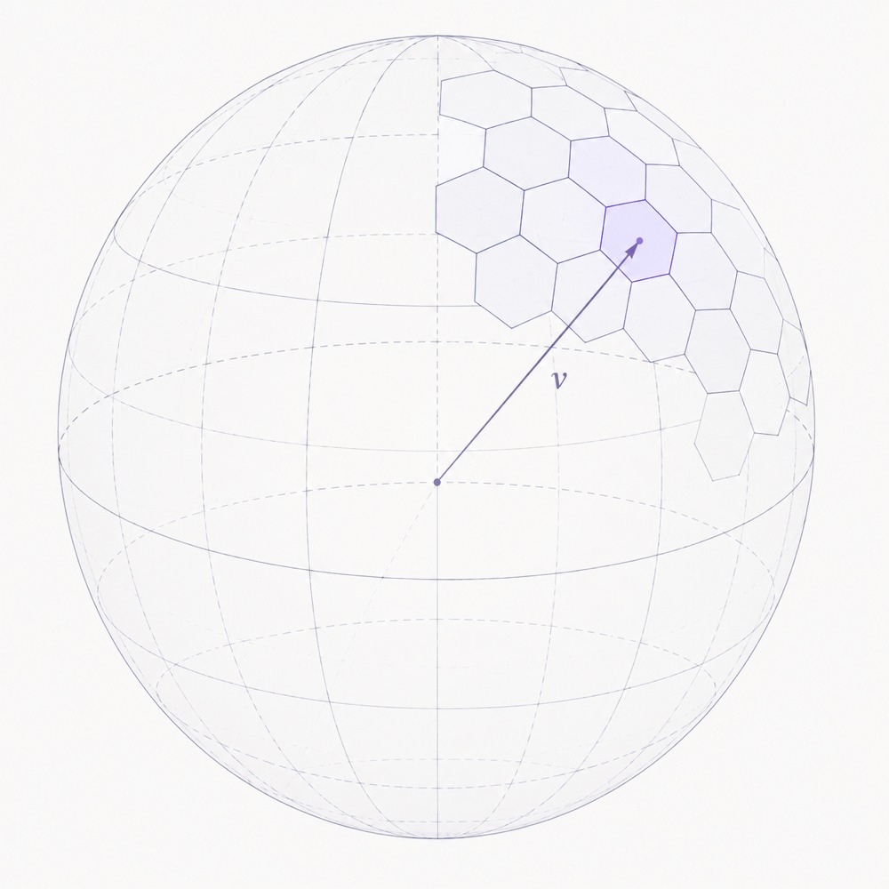

## Entropy, cross-entropy, and Perplexity

In physics, entropy measures the disorder of a system; the more random or "mixed" the system is, the bigger the entropy. It is believed that our fate is to witness the universe slowly dying by cooling down while turning into a uniform soup of molecules. However, within this homogenization process, several mildly interesting events occurred. Among them: the apparition of life, the first dinosaurs and the formulation of quantum mechanics.

The entropy in information theory is similar in spirit. It measures how far we are from a uniform distribution over the universe of possible values. We define the bits of information contained in a message occurring with probability $p$ as $-\log_2(p)$. To justify it, you can imagine a binary tree whose $N$ leaves are all the possible messages. To encode uniquely a path to each leaf, you need $\log(N)$ bits. From this definition, the entropy is defined as the expectation of information in the signal, concretely it is the integral of bits of information in a message weighted by the probability of this message occurring $-\int_{x\in\Omega} \log_2(p(x))\, p(x)\, dx$ which in the case of a discrete distribution gives $-\sum \log_2(p) \cdot p$.

The perplexity $2^{H(x)}$ represents the average number of choices a system has to pick from. It "undoes" the log we used to go from the space of *numbers of combinations* to the world of *bits required for encoding this information*. For example, if we had a universe over $N$ messages, we would need $\log_2(N)$ bits to code for all possible outcomes, but we would have a perplexity of $2^{\log_2(N)} = N$, which is why the term shows up so often in LLM literature.

LLMs are trained to predict the next word of a truncated text, given all the previous words. An LLM is a machine turning a sequence of words into a probability distribution over a dictionary. The corpus of text on which it is trained is all the records of human-made text, including stories, advertising and a slice of machine-generated data.

When training LLMs, two distributions are now at play. The first is the empirical distribution of what words are appearing in the continuation of the text. The second is the distribution of the model outputs.

Since we have only one version of a text, and not all the possible alternatives the same author could have written in a parallel universe, we represent the probability of the next word occurring by a distribution with 0 on all words of the dictionary, and 1 over this specific word. You may have heard this representation called a "one hot encoding" before.

We therefore can redefine a "cross" version of our previous entity: the cross entropy, $H(x, y) = -\sum_{w \in \text{Words}} \log(y_w) \cdot x_w$ where $x$ is the "real", one hot distribution and $y$ is the output distribution of the model. Similarly, we have a cross perplexity $\exp(H(x, y))$. In a beautiful and perfect world, plotting the log cross-perplexity (i.e. the cross-entropy) on the vertical axis and the log training time on the horizontal axis should give you a straight line trending down toward 0. Given that LLMs are trained (under supervised training) by minimizing the cross entropy between the ground truth one hot distribution and the model's output distribution, this isn't a surprise.

## On a Sphere

We now want to replace a discrete dictionary by the continuous unit sphere $S^{d-1}$ and derive the corresponding perplexity. There is no fundamental obstacle to considering a continuous case, and, since a finite-dimensional sphere is compact, there shouldn't be a major obstacle to integrating over it.

Let's assume that for each word at index $t$, we are given a vector on the sphere $x_t$. Let's also assume that our model outputs, for each prediction, a center $y_t$ of a distribution on the sphere,

$$q_t(z) = \frac{\exp\left(\kappa\, y_t^\top z\right)}{Z_d(\kappa)}$$

where $d$ is the vector dimension; $\kappa \geq 0$ controls concentration and larger $\kappa$ means the distribution is more sharply concentrated around $y_t$. The cross entropy for a single sample is then

$$\ell_t = -\log q_t(x_t) = \log Z_d(\kappa) - \kappa\, y_t^\top x_t.$$

Since our vectors are normalized $\lVert x_t \rVert = 1,\ \lVert y_t \rVert = 1$, their dot product is the cosine similarity $c_t = x_t^\top y_t = \cos(\phi)$ and we define the cosine error as $e_t = 1 - c_t$ where $\phi$ is the angle between these two vectors. Rewriting the cross-entropy in terms of $e_t$ we obtain

$$\ell_t = C + D\,(1 - y_t^\top x_t)$$

where $C$ and $D$ are two constants. If the entropy evolves linearly with training time, as discussed before, these two constants only shift the curve vertically and rescale its slope. Hence they do not change the training dynamic. For a mini-batch $B$ of size $\lvert B \rvert$, define the mean cosine error

$$\bar e_{B} = \frac{1}{|B|}\sum_{t \in B} e_t.$$

The batch cross-entropy is therefore

$$L_{B} = C + D\, \bar e_{B}.$$

In words, the previous equations tell us the log perplexity on a sphere is the average of the cosine errors between our predictions and the ground truth vectors. This gives us a connection between contrastive loss (aligning and reducing cosine error) and LLM training (minimizing perplexity).

I find it fascinating, and surprising, that both approaches (cross-entropy minimization and contrastive learning) lead to the identical loss.
