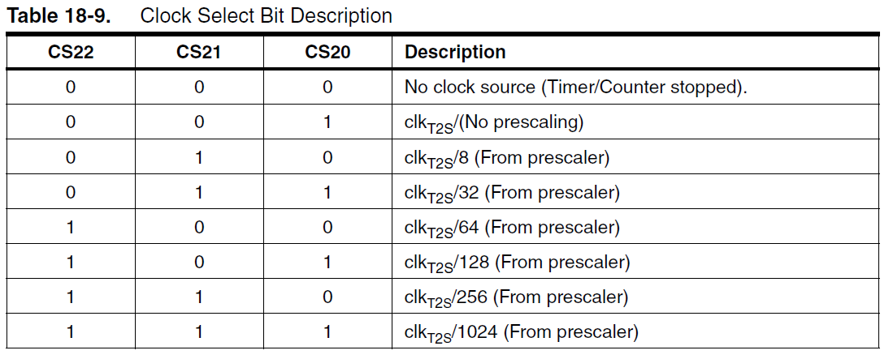

---
layout: post
title: ATMega328 (Arduino uno) TimerCounter et PWM à 62,5kHz
description: On discute ici du générateur d'onde carré de l'ATMega328, et de
  comment l'utiliser pour synthétiser un signal sonore quelconque en temps réelle.
  On repousse ainsi les limites de la bibliothèque musicale arduino.
author: Jérémy Cochoy
date: 2012-04-30 +0100
categories: arduino embeded asm pwm timer hardware atmega
lang: fr
...

## Timer/Counter et PWM pour des fréquences élevés.

Cette article traite de l'utilisation de certaines fonctionnalités de l'ATMega328P qui peuvent s’avérer utiles pour le traitement des signaux audio (par exemple, réaliser une pédale d'effet), jouer des samples de musique (échantillonnés à 44100Hz ou moins), ou encore réaliser de la synthèse sonore.

Il est question d'aborder ici le stricte minimum pour utiliser le PWM (Pulse Width Modulation) à une fréquence suffisamment élevé affin de pouvoir générer un signale analogique et de contrôler son amplitude. En bonus, nous pourrons exécuter une interruption toute les 16uS.

Je recommande fortement au gens aillant un peut d'expérience de lire directement la documentation relative aux Timers/Counters, PWM, et aux registres DDRx/PORTx.

### Timer et PWM

L'ATMega328P comprend 3 Timers, c'est à dire trois compteurs qui sont incrémenté par le microcontroleur tout les N ticks d'horloges (K peut valoir 1, 8, 32, 64, 256, 1024 celons vos envies). Ces timers se noment "Timer0", "Timer1" et "Timer2".  Le Timer0 est utilisé par la bibliothèque arduino pour évaluer l'écoulement du temps (delay, microsecond) et pour les sorties PWM associés à ce timer. Le Timer1 dispose d'un compteur 16bits, c'est à dire de 0 à 0xFFFF, alors que les timers 2 et 1 sont en 8bits (de 0 à 0xFF). L'idée est que nous voulons compter vite, très vite, donc nous avons intéret à utiliser un compteur 8bits. Notre choix se port donc tout naturellement sur le timer2.

Le PWM correspond à la mise sous tension d'une patte de l'ATMega durant un certain laps de temps, puis de sa mise à 0 durant un autre instant, et le tout répété très rapidement. Cela permet de simuler un signale analogique de tension comprise entre 5v et 0v (Moins si vous n'utilisez pas l'alimentation 5V). Le principe est très bien décrit par le schéma suivant provenant du site d'arduino(http://arduino.cc/en/Tutorial/PWM) :


Il faut savoir que chaque Timer controle deux sorties PWM. Les pattes correspondant à ces sorties sont indiqué sur la page 2 de la documentation atmel (OCnA et OCnB, où n est le numéro du timer). Dans notre cas nous utiliseront la sortie OC2A, qui correspond au pin 11 d'une carte arduino.

Le fonctionnement du PWM est extrêmement simple ; Vous réglez le PWM avec une valeur comprise entre 0 et 255, disons C. Alors, tant que le compteur est plus petit que C, il y auras une tension de 5V sur la sortie OC2A. Quand le compteur dépasse C, la tension passe à 0V. Pour accélérer une sortie PWM, il faut donc accélérer le timer qui est associé.

### Le mode FastPWM (ATMega328P datasheet p152-153)

Il existe plusieurs configurations possible pour la sortie PWM, la fréquence des timers, etc. Je vous conseille très fortement de lire la documentation atmel à ce sujet. Dans notre cas, nous cherchons la plus rapide, et il y en a une qui correspond tout à fait à nos besoins ; La configuration Fast PWM.

Le compteur que nous avons évoqué, associé au Timer2, se nome "TCNT2"(Timer Counter 2), et peut être lut et écrit à tout moment. La valeur à partir de la quel le signal bascule de 5V à 0V est stocké dans OCR2A(Output Compare Register 2 A). Un second registre de comparaison est disponible, OCR2B, et correspond au pin OC2B.

Dans ce mode, le comTCNT2 part de 0, puis atteint progressivement OCR2A. Alors, la tension de sortie de OC2A s'inverse. À cette instant, une interruption peut être déclenchée. C'est à dire, si vous n'êtes pas familier avec ce mécanisme, qu'une fonction que vous aurez préalablement écrite, compilé, et associé à ce mécanisme, seras exécuté. De même pour OCR2B/OC2B.

Le compteur continus sa montée, et atteint alors 0xFF. Il y a alors overflow : le compteur repasse à 0x00 à la prochaine incrémentation, et enclenche l'interruption TIMER2_OVF (Timer 2 Overflow), si elle est activée.

Sachez enfin que vous pouvez configurer si la tension de sortie avant que le compteur atteigne OCR2A doit être haute ou basse. Nous choisirons qu'elle est haute, puis basse. De cette façon, si OCR2A = 0, la tension sera 0 sur une période (16us, pour mémoire), et si OCR2A = 0xFF, elle sera de 5V (toujours sur une période).

Le schéma suivant, issu de la documentation, décrit une succession d’interventions sur le registre OCR2A, l'évolution du compteur, le déclenchement des interruptions, et les tensions de sorties(haut pour 5V et bas pour 0V) celons la configuration des deux bits COM2A1 et COM2A0 (Pour les valeur 2( = 1 0 en binaire) et 3 = (1 1 en binaire))


La fréquence à la quel l’interruption TOV2(TIMER2_OVF) est appelé se calcul aisément à partir de celle de l'horloge de l'ATMega. Si vous utilisez un quartz externe à 16MHz (c'est le cas des cartes arduino) la fréquence est alors $\frac{f_{clock}}{N . 256}$ où $N$ est le facteur d'échelle (prescale factor), dont nous parlerons un peu plus loin.

L'activation du mode FastPWM (p160 de la documentation) se fait en fixant les bits du "Timer Counter Control Register"  A et B (TCCR2A et TCCR2B).

Le premier contient le type de sortie COM2A1:0 et COM2B1:0, ainsi que les bits WGM21 WMGM20 contrôlant le mode de l'horloge.  Le second (p163)  contient le dernier bit de configuration du mode, WGM22 et les trois bits permettant de sélectionner le facteur d'échelle (dans notre cas, nous choisirons 1, pour que la fréquence soit la plus élevé) ; CS22, CS21, CS20.

Ainsi, nous pouvons déjà configurer le mode Fast PWM :
``` c
TTCCR2A = 1 << COM2A1 | 1 << WGM01 | 1 << WGM00;
TTCCR2B = 0 << WGM02 | 0 << CS22 | 0 << CS21 | 1 << CS20;
```
Nb : Sachez que pour chacun des modes, vous trouverez un tel schéma dans la documentation :)

### Facteur d'échelle

Les bits CS22, CS21 et CS20 permettent de configurer le facteur d’échelle.
Le concept est simple (p155 et p156 de la documentation pour des schéma
extrêmement claires) ; le compteur TCNT2 seras incrémenté de 1 tout
les N ticks d'horloge, où la valeur de n dépend du facteur d'échelle choisit,
d'après le tableau suivant (p164 de la documentation) :




### Activer la sortie PWM

Nous avons donc configurer le compteur, et la sortie PWM peut maintenant être utilisée. Mais encore faut-il l'activer. Pour cela, il faut sélectionner la "direction" du pin associé au comparateur A (OC2A) comme "OUTPUT". Cela se fait via le Data Direction Register B (car la sortie OC2A est la troisième patte du port B, c'est à dire la sortie 11 de la carte arduino).
``` c
DDRB |= 1 << DDB3;
```
Pour désactiver la sortie PWM lorsque le pin est toujours en mode output, il suffit de modifier la valeur de COM2A.

### Utiliser les interruptions

Le dernier outil, pour pouvoir par exemple effectuer une acquisition audio à  $31,25kHz$, est interruption OVF, déclenchée dès que le compteur passe de 0xFF à 0x00.  Pour ce faire, il faut informer le compilateur que votre fonction doit être associé à une interruption, et activer l'interruption grâce au masque d’interruption TIMSK2.
``` c
// Configuration
TIMSK2 = 1 << TOIE2;

// ...

ISR(TIMER2_OVF_vect)
{
  // Code de l'interruption
}
```

### La bibliothèque C AVR

Si nous pouvons utiliser toute ces macros, c'est bien quelles sont définit quelques part. Il s'agit d'une bibliothèque C permettant de développer sur les microcontroleurs atmel en C. Cette bibliothèque contient une documentation dont je recommande chaudement la lecture, notamment pour ceux qui souhaiterais diminuer le temps perdu en entête C dans l’interruption OVF (environs 20 à ticks d'horloge à 16MHz, ce qui représente tout de même 20 à 30 256ième du temps d’exécution de votre microcontroleur!)

Sachez aussi qu'une façon plus agréable d'écrire (1 << ABCD) est _BV(ABCD).

### Références:

 *  La bibliothèque C AVR (Interruptions) : <http://www.nongnu.org/avr-libc/user-manual/group__avr__interrupts.html>
 *  Atmel ATMega328 Datasheet : <http://www.atmel.com/images/atmel-8271-8-bit-avr-microcontroller-atmega48a-48pa-88a-88pa-168a-168pa-328-328p_datasheet_summary.pdf>
 *  Realtime Audio Processing de Martin Nawrath : <http://interface.khm.de/wp-content/uploads/2008/10/arduino_realtime_audio_eng.pdf>
 *  PWM : <http://arduino.cc/en/Tutorial/PWM>
