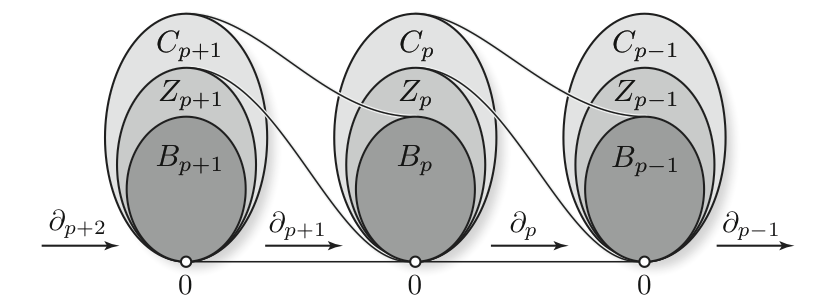

---

## Current research interests
  * Neural networks (CNN, RNN, GAN, VAE, etc..)
  * Signal processing
  * Genetic algorithm
  * Probabilistic programming

---

## Brief introduction to Persistent homology

During my thesis, I worked on __persistent homology__.
I was interested by linear representations of a specific type of quiver
usually constructed from partially ordered set.

One can consider the category $(\mathbb{R}, \leq)$ composed of the
reals number with their usual ordering.
A functor $(\mathbb{R}, \leq) \rightarrow Vect$ with values
in the category of vector spaces is then called a __persistence module__.
The index set (source category of this functors) can also be replaced
by sub-sets of $\mathbb{R}$ like $\mathbb{N}$ or $\mathbb{Z}$.
This functors have a natural structure of modules over a "polynomial" ring,
function of the index set. In the case of $\mathbb{N}$, the ring is $k[x]$.
The name of __persistence module__ come from this structure of module over a ring.

If we allow more dimensions by taking as index set
$(\mathbb{R}^n, \leq)$ with $(x_1, \dots, x_n) \leq (y_1, \dots, y_n) \Leftrightarrow x_1 \leq y_1, \dots$, we name this construction as _multipersistence_.
If the order of the index set alternate, like it is the case with the quiver given by $0 \leq 1 \geq 2 \leq 3 \geq \dots$, the construction is called _zigzag persistence_.

This functor,
with values in the category of vector spaces,
can be obtain by computing the homology of a filtered topological space.
Hence the name __persistent homology__.
The simplest construction consist of taking a point cloud $P \subset \mathbb{R}^m$,
and then computing the sub-levelset of the (euclidean) distance function to the point cloud: $X_k = d^{-1}_P(]-\infty, k])$. This collection of sets is called a filtration.
We obtain our persistence module by applying the homology functor
$\mathbb{N}$ : $H(X_0) \rightarrow H(X_1) \rightarrow \dots$.

During my PhD I was looking for decomposition theorems and stability results for the signature
made from this multipersistence modules.

--------------------------------------------------

## Dissertation

I wrote my [PhD][phd-hal] at the INRIA-Saclay, Palaiseau(France) located near Paris under
the direction of [Steve Oudot][steve-oudot] as a member
of the [Datashape (former geometrica)][datashape] team.
My research focused on __Persistence Modules__ and its generalization where
the index set is $\mathbb{R}^2$.

--------------------------------------------------

## Talk:
* [Persistent Algebras](pre-algebra) during the [JGA 2017](https://jga2017.sciencesconf.org/)

## Papers:

* [Decomposition of exact pointwise finite dimensional persistence bimodules](https://arxiv.org/abs/1605.09726) J. Cochoy, S. Oudot.
* [Decomposability and stability of multidimensional persistence](phd-hal) J. Cochoy

[phd-hal]: https://tel.archives-ouvertes.fr/tel-01988780/document
[steve-oudot]: https://geometrica.saclay.inria.fr/team/Steve.Oudot/
[datashape]: https://team.inria.fr/datashape/research/
[pre-algebra]: pres-algebra-persistence-modules.pdf
